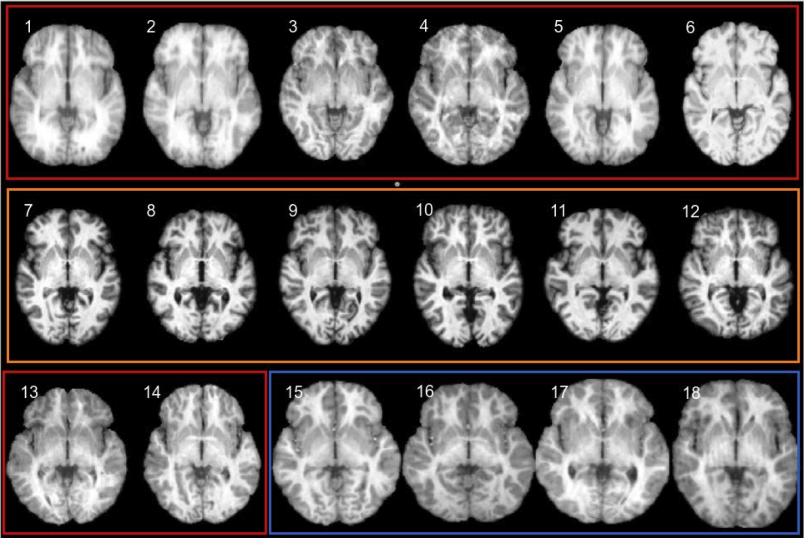

# Enhancing Brain Tissue Analysis: A 2D and 3D CNN Ensemble Approach for MRI Segmentation
Authors: Xavier Beltran Urbano and [Frederik Hartmann](https://github.com/Frederik-Hartmann)

## Dataset
The dataset used in this study is the IBSR18, containing 18 T1-weighted scans of normal subjects from the Internet Brain Segmentation Repository (IBSR). It includes preprocessed scans with a 1.5 mm slice thickness and ground truth segmentation for white matter (WM), grey matter (GM), and cerebrospinal fluid (CSF).

  
   
  <em>Example of the IBSR18 Dataset</em>

## Methodology
Our approach employs an ensemble of 2D and 3D convolutional neural networks for brain tissue segmentation in MR images. We tested various architectures like U-Net, Res-U-Net, Multi-Resolution-U-Net, Dense-U-Net, and SegResNet. The dataset was divided into training, validation, and test sets. Preprocessing steps included normalization and data augmentation. We experimented with different input orientations (axial and coronal) and employed techniques like weighted categorical cross-entropy loss, learning rate scheduling, early stopping, and model selection based on validation loss.

## Results
### Single Model Results
| Model                     | CSF Dice | GM Dice | WM Dice | Mean Dice | CSF HD | GM HD  | WM HD  | Mean HD |
|---------------------------|----------|---------|---------|-----------|--------|-------|--------|---------|
| 2D Coronal U-Net          | 0.878    | 0.937   | 0.933   | 0.917     | 39.352 | 11.344 | 10.443 | 20.380  |
| 2D Coronal Dense U-Net    | **0.899**| 0.937   | 0.938   | 0.925     | 17.168 | 12.199 |  **8.149** | 12.502  |
| 2D Coronal Multi-U-Net    | 0.890    | 0.935   | 0.936   | 0.920     | 26.234 | 13.391 |  8.422 | 16.016  |
| 2D Coronal Res-U-Net      | 0.882    | 0.931   | 0.931   | 0.915     | 21.894 | 12.000 | 10.905 | 14.933  |
| 2D Axial U-Net            | 0.868    | 0.929   | 0.922   | 0.906     | 26.598 |  9.876 |  9.887 | 15.454  |
| 2D Axial Dense-U-Net      | 0.868    | 0.920   | 0.920   | 0.902     | 27.137 | 11.281 | 10.580 | 16.333  |
| 2D Axial Multi-U-Net      | 0.876    | 0.923   | 0.926   | 0.908     | 30.938 | 10.546 |  9.872 | 17.119  |
| 2D Axial Res-U-Net        | 0.866    | 0.925   | 0.921   | 0.904     | 23.733 | 21.277 | 10.113 | 18.375  |
| 2D Seg-Res-Net            | 0.877    | 0.933   | 0.935   | 0.915     | **13.540** |  9.977 |  9.449 | **10.989**  |
| 3D U-Net                  | 0.882    | **0.942**| **0.942**| **0.922**| 16.202 | 12.864 | 11.574 | 13.486  |
| 3D Seg-Res-Net            | 0.888    | 0.935   | 0.937   | 0.921     | 15.198 | 10.367 |  9.541 | 11.702  |
| SynthSeg                  | 0.812    | 0.829   | 0.888   | 0.843     | 29.822 |  **8.353** | 12.066 | 16.747  |
*Table 1: Single model results on the validation set.*

### Ensemble Results

| Model                               | CSF Dice | GM Dice | WM Dice | Mean Dice | CSF HD | GM HD  | WM HD  | Mean HD |
|-------------------------------------|----------|---------|---------|-----------|--------|-------|--------|---------|
| The Coronal Ensemble Mean           | 0.895    | 0.939   | 0.939   | 0.925     | 18.508 | 9.630  | 7.783  | 11.974  |
| The Coronal Ensemble Maximum        | 0.893    | 0.939   | 0.939   | 0.923     | 23.860 | 9.811  | 8.843  | 14.171  |
| The Coronal Ensemble Majority       | 0.890    | 0.939   | 0.937   | 0.922     | 19.123 | 11.465 | 7.564  | 12.717  |
| The Axial Ensemble Mean             | 0.884    | 0.930   | 0.928   | 0.914     | 17.121 | 10.704 | 9.127  | 12.317  |
| The Axial Ensemble Maximum          | 0.881    | 0.930   | 0.927   | 0.913     | 23.055 | 10.655 | 9.782  | 14.498  |
| The Axial Ensemble Majority         | 0.877    | 0.930   | 0.925   | 0.911     | 22.114 | 10.946 | 9.277  | 14.112  |
| The Coronal + Axial Mean            | 0.897    | 0.939   | 0.938   | 0.925     | 16.410 | 8.902  | 9.095  | 11.469  |
| The Coronal + Axial Maximum         | 0.893    | 0.938   | 0.937   | 0.923     | 21.901 | 10.270 | 9.370  | 13.847  |
| The Coronal + Axial Majority        | 0.894    | 0.940   | 0.938   | 0.924     | 16.611 | 9.811  | 8.653  | 11.692  |
| The Multidimensional Ensemble Mean  | **0.904**    | **0.945**   | **0.948**   | **0.932**     | **11.918** | **8.730**  | **7.660**  | **9.436**   |
*Table 2: Ensemble results on the validation set.*

## Conclusion
The study clearly illustrates the efficacy of an ensemble methodology that synergizes 2D and 3D convolutional neural networks (CNNs) for segmenting brain tissue. This innovative approach benefits significantly from leveraging various orientations of 2D slices, in combination with both 2D and 3D models. This multifaceted strategy enhances the accuracy of segmentation substantially. Among the various techniques explored, the ensemble method, especially the mean of probabilities technique, stands out for its exceptional robustness and precision in results.